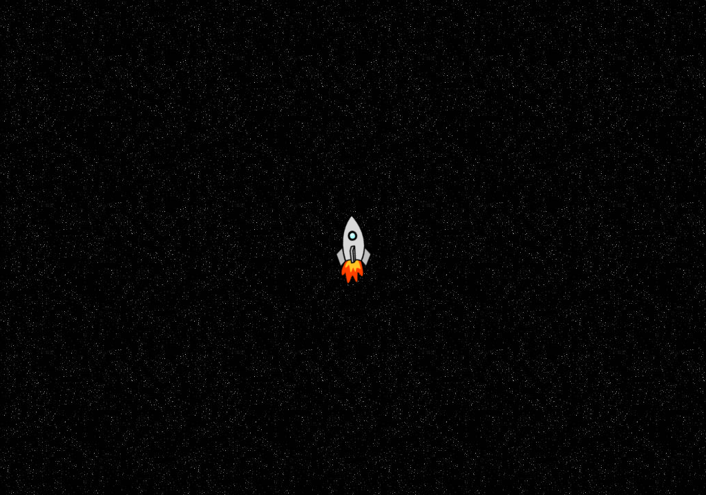
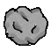
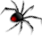

# Concepto del Juego
[Cronograma](https://trello.com/invite/b/F1I4yZwf/09e89c3d11b2f180105f17956ce3f496/space-game)

## Problema
El juego que pensamos desarollar es uno para personas a las que les gustan los juegos de reflejos rápidos y estrategias en tiempo real, sin embargo no sé muy bien si el concepto del juego apela realmente a estas personas y cómo podríamos adaptarlo mejor a ellas. Las entrevistas que siguen son un intento de entender mejor al consumidor para desarrollar un juego que realmente utilicen.

## Entrevistas
**Entrevistada:** Nicolle Gordillo

* **¿Alguna vez ha jugado juegos de shooters en tercera persona o de supervivencia por rondas?:** No
    * **¿Por qué no?** No juego muchos juegos.
* **¿Cree que jugaría el concepto del juego presentado?** Sí me gustaría.
* **¿Considera que puede mejorarle algo?** No tengo nada que agregar pues me gusta como esta.

**Entrevistado:** José Galán

* **¿Alguna vez ha jugado juegos de shooters en tercera persona o de supervivencia por rondas?:** Sí.
    * **¿Cuáles?** Pew Pew Live, Call of Duty Zombies, Fortnite
* **¿Cree que jugaría el concepto del juego presentado?** Si es gratis sí.
* **¿Considera que puede mejorarle algo?** Talvez pagaría por el juego si tuviera modo online para jugar con mis amigos.

**Entrevistado:** Carlos Valladares

* **¿Alguna vez ha jugado juegos de shooters en tercera persona o de supervivencia por rondas?:** Sí
    * **¿Cuáles?** Call of Duty Zombies
    * **¿Por qué no?**
* **¿Cree que jugaría el concepto del juego presentado?** Si, me parece una idea bastante entretenida.
* **¿Considera que puede mejorarle algo?** Mejorar no, pero se podrían implementar tipo asteroides.

## Mapa de Empatía
|¿Qué Piensa?|¿Qué ve?|
|---|---|
|La mayoría de los entrevistados han tenido alguna experiencia jugando en shooters en tercera persona o juegos de supervivencia por rondas, por lo que posiblemente tienen preconcepciones sobre el género.|A la gran mayoría les gustó la forma en la que se mira.|
|¿Qué oye?|¿Qué dice?|
|Escuchan posiblemente de streamers o de influencers sobre juegos parecidos y lo que es tendencia actualmente.|Dicen que estarían dispuestos a probarlos y se encuentran interesados en juegos de este tipo, aunque no pagarían por él.|

## Resumen Ideación
El juego es un _survival shooter_ en tercera persona por oleadas.

## Contexto
Eres el capitán de la última restante después de que la humanidad fuera invadida por alienígenas, a pesar de la resistencia en el planeta Tierra, los alienígenas lograron conquistarla. Decides que intentar retomar la Tierra es una causa perdida en este momento siendo solamente tu contra todos los Aliens, por lo que decides retirarte a otro sistema solar en la galaxia, sin embargo en tu huída te detectan las naves alienígenas y no piensan dejarte escapar.

## Gameplay Loop
En el modo un jugador controlas una nave e intentas sobrevivir lo más que puedas mientras te llegan enemigos cada vez más difíciles. Posiblemente se agreguen más tipos de naves para que puedas experimentar el juego desde distintos _playstyles_ y mantener las cosas frescas. Además esporádicamente aparecerán _power-ups_ en la pantalla para que el jugador pueda sobrevivir más tiempo o salir de una situación peligrosa. CAda nave tiene una ultimate, que le permite realizar algo que impacta gravemente el espacio de juego.

En el modo para dos jugadores el jugador uno controla la nave mientras que el jugador 2 controla a los alienígenas. Todas las mecánicas del jugador 1 se mantienen igual. El rol del jugador 2 es acabar con el jugador 1, cada cierto tiempo el jugador 2 recibe cierta cantidad de monedas que le permiten comprar naves alienígenas, a su vez, cada vez el que el jugador 1 elimine a una nave alienígena, el jugador 2 recibe monedas, esto incentiva al jugador 1 a mantenerse vivo sin matar a los alienígenas. El jugador 1 gana si sobrevive 3mins.

## Enemigos
Se tendrán 5 tipos de naves alienígenas:
* **Piedra**: Flota en línea recta y se divide en 2 al ser destruida por primera vez, sus piedras hijas ya no se dividen al ser destruidas.
* **Robot**: Es un enviado kamikaze por los aliengs, sigue al jugador por el mapa hasta que lo alcanza y se autodestruye chocándose con él.
* **Araña**: Esta nave inspirada en las arañas deja minas por todo el mapa, estas pueden ser estalladas con disparos de tu nave, ten cuidado de no encontrarte en el área de explosión cuando hagas esto.
* **Pescado**: El pescado aumenta la cantidad de enemigos que pueden ser aparecer. En el modo de dos jugadores este aumenta la cantidad de dinero que recibe por cada nave asesinada así como lo que recibe por tiempo.
* **Steel Ball**: Esta pelota de hierro protege a las naves alienígenas enemigas con su escudo que se recarga cada cierto tiempo.

## Arte conceptual
**Menú Principal**

**Inicio Primer Nivel**

**Nave Espacial**

**Fondo**

**Power-ups**

**Curación**

**Punto de Ultimate**

**Escudo**

**Enemigos**
(Por orden de complejidad, menor a mayor)

